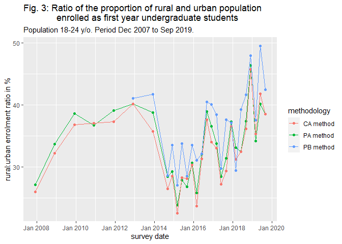

Code Book
================
Max Aantjes
07/06/2020

This code book summarises the **objective** of the project, provides
links to the **raw data** it relies on, explains the **method** used and
lists the **variables**.

## Objective

The objective of this project is to analyse the gap between the access
to higher education of rural and urban population in Ecuador, with a
particular focus at the undergraduate level. If possible, the impact of
the introduction of national university entrance exams in 2013 will be
considered. Two alternative hypotheses will be tested:

  - *Ha1*: Access to higher education is significantly different between
    rural and urban populations.
  - *Ha2*: The gap between the access to higher education between rural
    and urban populations significantly decreassed since the
    introduction of the university entrance exams.

## Raw Data

All raw data used in this analysis was collected by
[INEC](https://www.ecuadorencifras.gob.ec/) (Instituto Nacional de
Estadística y Census) of Ecuador over various years. Raw data is
available for 3 to 4 periods each year from September 2014 to September
2019) and once a year from December 2005 to December 2013. The data is
automatically downloaded and extracted from temporary folders when
running Module 0 in the R code files. However, the **form** used to
collect the data (*“formulario”*) and the raw data of the **answers**
(*“Bases de Datos”*) can also be manually downloaded through these
online government repositories:

### Sep 2014 - Sep 2019

#### *File extension: .sav/.csv*

  - link to [government data repository for the
    year 2019](https://www.ecuadorencifras.gob.ec/enemdu-2019/);

  - link to [government data repository for the
    year 2018](https://www.ecuadorencifras.gob.ec/enemdu-2018/);

  - link to [government data repository for the
    year 2017](https://www.ecuadorencifras.gob.ec/enemdu-2017/);

  - link to [government data repository for the
    year 2016](https://www.ecuadorencifras.gob.ec/enemdu-2016/);

  - link to [government data repository for the
    year 2015](https://www.ecuadorencifras.gob.ec/enemdu-2015/);

  - link to [government data repository for the
    year 2014](https://www.ecuadorencifras.gob.ec/enemdu-2014/).

### Dec 2005 - Dec 2014

#### *File extension: .sav/.rbs*

  - link to compilation of [government data repositories
    before 2014](https://educacion.gob.ec/enemdu/).

Zipped .sav files from the years 2007 - 2014 are available from the
[“Bases de datos ENEMDU completas
(2331)”](https://educacion.gob.ec/wp-content/uploads/downloads/2017/06/BBDD_ENEMDU_Completas.zip)
masterfile link. However, there seem to be missing columns and the
2005/2006 data is missing. The data is downloadable in .rbs format
through the individual links on the page linked above. Nevertheless, I
have not been able to extract this data into R. These files can be read
by the REDATAM programme developed by CEPAL and, according to the
software’s suplementary documentation, should be extractable through a
combination of python and SQL:

  - link to [REDATAM
    download](https://www.cepal.org/en/topics/redatam/download-redatam);
  - link to [REDATAM extraction
    guide](https://www.cepal.org/es/enfoques/open-census-framework-extraer-procesar-datos-censales-redatam)
    (Python required + Spanish).

### Geographic Classification Postcodes

#### *File extension: .pdf*

Additionally, division of postcodes in rural and urban areas was
required for the analysis. As tidy data of such a division is not
publically available at the time of writing, a pdf file from the
Ecuadorian government stemming from 2019 was used:

  - link to [list of postcodes divided per region and rural and urban
    areas](https://aplicaciones2.ecuadorencifras.gob.ec/SIN/descargas/cge2019.pdf).

## Method

To measure anual to anual changes in the access to education, the
analysis counts the amount of **first-year** students who are **at the
time of the survey** attending higher education. The reason for counting
first years is that there’s no way to differentiate annual enrolment
from graduation years, as undergraduate studies in Ecuador vary in
length. It then classsifies them as either rural or urban. The number of
rural first-year students and the number of urban first-year students
are subsequently divided by the total number of rural surveyees and
urban surveyees in the apropriate age range, respectively. These
standardised proportions give an indication of the percentage of the
urban and rural population of interest who are at the time of the survey
first year students. Finally, the standardised rural proportion is
divided by the standardised urban proportion to generate a ratio in
percentage form. These steps are followed for each individual survey to
generate a time-series of ratios in percentage form.

*Interpretation of ratio*: If the calculated ratio equals 100%, access
to higher education is equal in rural and urban areas. If the ratio is
lower than 100%, access to higher education is lower in rural areas than
in urban areas. If the ratio is higher than 100%, access to higher
education is higher in rural areas than in urban areas. Furthermore, if
the ratio approaches 100% over time, the gap in the access to higher
education between the two areas decreases. Conversely, if the distance
between the ratio values and 100% increases over time, this gap
increases.

*Interpretation of rural/urban classification*: One important
specification for the analysis is the classification of survey
respondents as rural or urban citizens. As there are different possible
methods of classification, three different methods of classifying
respondents were used and compared in the analysis:

  - **CA**: identification according to current address (which is
    essentially the survey location). This corresponds with the two
    level factor (urban/rural) variable INEC refers to as “area”.
    **Potential limitation**: Prospective students of rural origin might
    move from rural to urban areas for academic reasons and vice versa.
    In this case, their current address does not accurately reflect
    their origin. This means that the effects of any policies which
    increase access to higher education by enabling prospective students
    to migrate (internally) will not be reflected in the data.

  - **PB**: identification according to place of birth, which is
    represented in survey responses as a postcode. A function is used to
    classify postcodes into rural and urban areas according to 2019
    classification by the Ecuadorian government. **Potential
    limitation**: data on place of birth is surprisingly only available
    from December 2013 onwards. Additionally, there are over 30.000
    respondents who indicated they were *not* born at their current
    address, but also that they have *never* moved. How to interpret
    this data is unclear. For example, it could be the case that the
    hospitals these respondents were born in were at a different
    location than their maternal home. Alternatively, respondents might
    simply underreport their migration history.

  - **PA**: identification for all respondents according to current
    address *apart from* first year students who migrated for academic
    reasons, who are classified according to their prior address.
    **Potential limitation**: the data indicates that there is a very
    low level of reported urban-rural and rural-urban migration for
    academic reasons (on average under 1% of first year students). As
    such, it is questionable whether this migration data is accurate and
    relevant.

## Variables

Most analysed variables in the tidied data set are based on one or a
combination of the questions in the census form. Again, this form and
its codebook are available for almost every survey date present in the
links above (for data before 2014 it is only available in the .sav files
themselves). Below is a list with information about the variables in the
generated tidy data set, including their name, class, respective
question identification codes, description, levels and the R code module
in which they were created.

### Tidied Data Set

| ModuleNO | Name                   | QuestionID           | Description                                                                                                                                                                                                                                                                                                                                                                                                                                                                                        | Class   | Levels                                                                                                              |
| :------- | :--------------------- | :------------------- | :------------------------------------------------------------------------------------------------------------------------------------------------------------------------------------------------------------------------------------------------------------------------------------------------------------------------------------------------------------------------------------------------------------------------------------------------------------------------------------------------- | :------ | :------------------------------------------------------------------------------------------------------------------ |
| 1        | survey.date            | none                 | The survey date reported by INEC.                                                                                                                                                                                                                                                                                                                                                                                                                                                                  | yearmon | sep 2019 = september 2019, etc.                                                                                     |
| 1        | age                    | p03                  | Age of the respondent.                                                                                                                                                                                                                                                                                                                                                                                                                                                                             | integer | 1 = 1 year old, 2 = 2 years old, etc.                                                                               |
| 1        | ethnicity              | p15                  | Self-identified classification of cultural affiliation.                                                                                                                                                                                                                                                                                                                                                                                                                                            | factor  | 1 = indigenous, 2 = afroecuadorian, 3 = black, 4 = mulatto, 5 = montubio, 6 = mestizo, 7 = white, 8 = other         |
| 1        | ever.moved             | p16a                 | Response to: ‘Have you ever changed address?’ Converted to postive question from its negative equivalent in original survey.                                                                                                                                                                                                                                                                                                                                                                       | factor  | 1 = yes, 2 = no                                                                                                     |
| 1        | current.address        | area                 | Area classification of the current address of the respondent.                                                                                                                                                                                                                                                                                                                                                                                                                                      | factor  | 1 = urban, 2 = rural                                                                                                |
| 1 & 3    | location.prior.address | p17a & p17b          | Area classification of the prior address of the respondent. The original data was presented in country and postal codes according to government classification. Codes that did not match were indicated accordingly. For respondents which had always lived at their current address the value ‘none’ was assigned.                                                                                                                                                                                | factor  | 1 = urban, 2 = rural, 3 = abroad, 4 = none, 5 = code not found                                                      |
| 1 & 3    | place.of.birth         | area & p15aa & p15ab | Area classification of the place of birth of the respondent. If the respondent indicated no difference between current address and place of birth (p15aa), area was used as place of birth. If they indicated a difference, the country and postal codes provided by the respondent as their place of birth (p15ab) were classified as urban or rural according to government classification. Codes that did not match were indicated accordingly. Data not available for surveys before Dec 2013. | factor  | 1 = urban, 2 = rural, 3 = abroad, 5 = code not found                                                                |
| 1        | reason.for.migration   | p18                  | Reason for latest migration.                                                                                                                                                                                                                                                                                                                                                                                                                                                                       | factor  | 1 = work, 2 = salary increase, 3 = marriage, 4 = health, 5 = acquisition of property, 6 = family reunion, 7 = other |
| 1        | higher.education.level | p10a                 | Highest level of education the respondent is or was enrolled in. Originally 10 levels, but reduced to 4 by classifying all non-higher education levels as one level.                                                                                                                                                                                                                                                                                                                               | factor  | 1 = none, 2 = technical school, 3 = undergraduate, 4 = postgraduate                                                 |
| 1        | no.years.completed     | p10b                 | The number of years a respondent who is not attending classes has completed in their highest level of education. The year a respondent who is attending classes is matriculated in.                                                                                                                                                                                                                                                                                                                | integer | 1 = year 1, 2 = year 2, etc.                                                                                        |
| 1        | currently.matriculated | p07                  | Response to ’Are you currently attending classes?                                                                                                                                                                                                                                                                                                                                                                                                                                                  | factor  | 1 = yes, 2 = no                                                                                                     |

### Analysis of Gap in Access to Higher Education

Below is a list with information about the variables derived from the
tidy data set, including their name, class, description, levels and the
R code module in which they were created, as well as the tidy data set
variables they are derived from.

| ModuleNO | Name              | BaseVariables                                                                                                                                                        | Description                                                                                                                                                                                                                                                                                                            | Class   | Levels |
| :------- | :---------------- | :------------------------------------------------------------------------------------------------------------------------------------------------------------------- | :--------------------------------------------------------------------------------------------------------------------------------------------------------------------------------------------------------------------------------------------------------------------------------------------------------------------- | :------ | :----- |
| 4        | ages.of.interest  | age, currently.matriculated, number.of.years.completed, higher.education.level                                                                                       | List of age groups which in the total data set (all survey.dates) count more 500 registered first-year undergraduate students. This is the population of interest used for standardization purposes. This minimum is purposefully set high due to the differences in the aging of population in rural and urban areas. | vector  | NA     |
| 4        | prop.rural        | current.address, location.prior.address, ever.moved, place.of.birth, reason.for.migration, higher.education.level, currently.matriculated, number.of.years.completed | Proportion of rural population within ages of interest who are at the time of the survey enrolled as first year undergraduates. Classification according to PA, CA or PB method.                                                                                                                                       | numeric | NA     |
| 4        | prop.urban        | current.address, location.prior.address, ever.moved, place.of.birth, reason.for.migration, higher.education.level, currently.matriculated, number.of.years.completed | Proportion of urban population within ages of interest who are at the time of the survey enrolled as first year undergraduates. Classification according to PA, CA or PB method.                                                                                                                                       | numeric | NA     |
| 4        | urban.rural.ratio | prop.rural, prop.urban                                                                                                                                               | ratio of the proportions of urban and rural population enrolled as first year students. The direction of the ratio is rural:urban. Classification according to PA, CA or PB method. Interpretation of ratio explained in ‘method’ section.                                                                             | numeric | NA     |

## Preliminary Results

Below are the results found in the analysis. Graph 1 and graph 2
indicate that there was an upward trajectory in the access to higher
education in rural and urban areas between 2008 and 2009. Between 2009
to 2013 access to higher education stagnated in both rural and urban
areas, between 3-4% and 7-9 % respectively. This period was followed by
a steep drop from 2013 to 2015 to under 2% in rural areas and a similar
drop to under 6% in urban areas. From 2015 onwards, the access to higher
education in both areas gradually recovered.

Graph 3 indicates that in 2008, urban respondents were almost 4x as
likely to be enrolled in higher education. From 2008 to 2009 this gap
decreased to less than 3x. However, the urban population was harder hit
by the fall to access in education between 2009 and 2013, with the ratio
dropping to a minimum of less than 23-25% according to the PA and CA
method, and 27.5% according to the PB method. In subsequent years, the
ratio increased from this minimum to around 38-43%. The fluctuation of
this increase is noteworthy.

Without having conducted statistical tests, the data seems to support
both ha1 and ha2. Additionally, it seems to indicate that the
introduction of the entrance exam test coincided with a fall in
undergraduate enrolment nationwide and a deepening of the gap between
rural and urban access to education.

<!-- --><!-- --><!-- -->

\[placeholder\]
